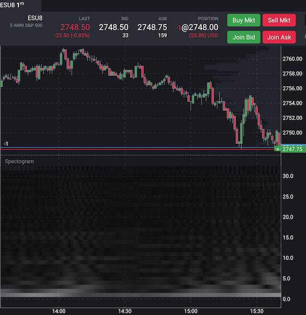

Our [Spectrogram](https://en.wikipedia.org/wiki/Spectrogram) has a lot in common with our previous indicator. Let's move out such pieces to a new helper module:
 
```javascript
const FFT = require("fft");
 
function initialize(instance) {
   const period = instance.props.period;
   instance.fft = FFT(period);
   instance.signal = new Array(period);
   instance.zero = new Array(period);
   for(let i=0; i<period; ++i) {
       instance.zero[i] = 0.0;
   }
   instance.lastIndex = -1;
}
 
function updateSeries(instance, value, index) {
   const period = instance.props.period;
   if (index < period) {
       instance.signal[period - index - 1] = value;
   }
   else {
       if (instance.lastIndex < index) {
           instance.signal.pop();
           instance.signal.unshift(value);
       }
       else {
           instance.signal[0] = value;
       }
   }
 
   instance.lastIndex = index;
 
   if (index >= period) {
       const re = [].concat(instance.signal);
       const im = [].concat(instance.zero);
       instance.fft.fft1d(re, im);
       return { re, im };
   }
}
 
module.exports = {
   initialize,
   updateSeries,
   tag: "Fourier Analysis"
};
```
 
Let's save it with the `fourierCommon.js` name.
 
Refactored `fourierMA` will be reduced up to the next version:
 
```javascript
const predef = require("./tools/predef");
const FFT = require("fft");
const fourierCommon = require("./fourierCommon");
 
class fourierMA {
   init() {
       fourierCommon.initialize(this);
   }
 
   map(d, index) {
       const period = this.props.period;
       const value = d.value();
 
       const transform = fourierCommon.updateSeries(this, value, index);
 
       if (transform) {
           const re = transform.re;
           const im = transform.im;
 
           const middle = period / 2 + 1;
           const startFreq = this.props.filterFreqStart;
           for(let i=startFreq; i<middle; ++i) {
               re[i] = im[i] = 0.0;
               re[period - i] = im[period - i] = 0.0;
           }
 
           this.fft.ifft1d(re, im);
 
           return re[0];
       }
   }
}
 
module.exports = {
   name: "fourierMA",
   description: "Fourier MA",
   calculator: fourierMA,
   params: {
       period: predef.paramSpecs.period(64),
       filterFreqStart: predef.paramSpecs.period(16),
   },
   tags: [fourierCommon.tag],
};
```
 
The Spectrogram indicator will use the same approach to calculate Fourier coefficients.
Then, we will build a custom plotter that will show these coefficients as 2D map of frequencies and their amplitudes.
 
```javascript
const predef = require("./tools/predef");
const meta = require("./tools/meta");
const FFT = require("fft");
const fourierCommon = require("./fourierCommon");
const p = require("./tools/plotting");
 
class spectrogram {
   init() {
       fourierCommon.initialize(this);
       this.peakValue = 0;
   }
 
   map(d, index) {
       const period = this.props.period;
       const value = d.value();
 
       const transform = fourierCommon.updateSeries(this, value, index);
 
       if (transform) {
           const amplitudes = [];
           const n = period / 2 + 1;
           for(let i=1; i<n; ++i) {
               const re = transform.re[i]/period;
               const im = transform.im[i]/period;
               const amplitude = 2 * Math.sqrt(re * re + im * im);
               amplitudes.push(amplitude);
               this.peakValue = Math.max(this.peakValue, amplitude);
           }
           return {
               amplitudes,
               lower: 1,
               upper: period / 2 + 1
           };
       }
       else {
           return {};
       }
   }
}
 
function hexhex(d) {
   return (d < 16 ? "0" : "") + d.toString(16);
}
 
function toRgb(r, g, b) {
   return "#" + hexhex(r) + hexhex(g) + hexhex(b) + "80";
}
 
function heatmapPlotter(canvas, instance, history) {
   const period = instance.props.period;
   const heatmap = p.createHeatmap(1, period / 2 + 1);
   for(let i=0; i<history.data.length; ++i) {
       const item = history.get(i);
       if (item.amplitudes) {
           const colors = item.amplitudes.map(
               (amp) => {
                   const colorValue = Math.round(255 * amp / instance.peakValue);
                   return toRgb(colorValue, colorValue, colorValue)
               });
           heatmap.addColumn(p.x.get(item), colors);
       }
   }
   canvas.drawHeatmap(heatmap.end());
}
 
module.exports = {
   name: "spectrogram",
   description: "Spectrogram",
   calculator: spectrogram,
   params: {
       period: predef.paramSpecs.period(64)
   },
   tags: [fourierCommon.tag],
   areaChoice: meta.AreaChoice.NEW,
   plotter: [
       predef.plotters.custom(heatmapPlotter)
   ],
   scaler: predef.scalers.multiPath(["lower", "upper"])
};
```
 
Because there are no regular plots and the app can struggle to evaluate min/max values of indicator to properly auto-scale it in the area, we implemented {@linkcode Indicator.scaler} field in the module's export. It will tell the app to use two fields from the output for scaling, even if they are not plotted.
 
The same `lower` and `upper` fields are used as domain boundaries for the heatmap object. Each column of the heatmap is a list of colors that divides a space between `lower` and `upper` to equal pieces.
 

 
Note: vertical axis shows frequency as a divider of the period of the indicator. For example, `1` corresponds to the whole period, `2` - twice faster than indicator's period, etc.
